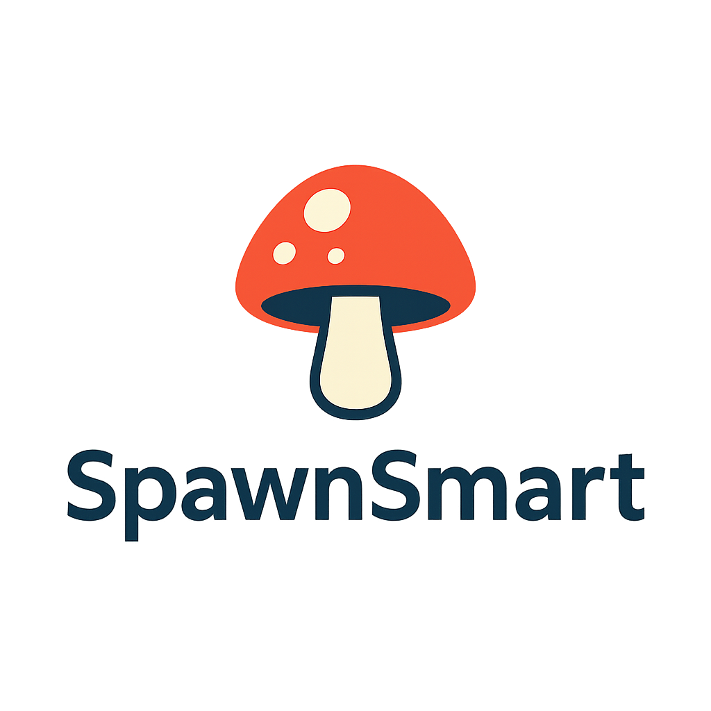

# SpawnSmart



Your intelligent calculator for perfect mushroom cultivation - optimize spawn-to-substrate ratios for maximum yields, faster colonization, and professional results.

## Overview

SpawnSmart is a React-based web application designed to help mushroom cultivators of all experience levels optimize their cultivation process. The application provides precise calculations for spawn-to-substrate ratios, personalized recommendations based on user inputs, and AI-powered cultivation advice.

## Key Features

- **Intelligent Ratio Calculator**: Calculate optimal substrate amounts based on spawn quantity and experience level
- **Dynamic Ingredient Breakdown**: View detailed substrate ingredient calculations based on selected substrate type
- **Experience-Based Recommendations**: Get tailored recommendations for your experience level (beginner, intermediate, expert)
- **AI-Powered Cultivation Advice**: Receive personalized cultivation tips generated by OpenAI based on your specific setup
- **Interesting Mushroom Facts**: Learn fascinating scientific facts about mushrooms while using the application
- **User Preference Storage**: Save your settings locally for future sessions
- **Responsive Design**: Enjoy a seamless experience across different devices
- **Rate-Limited API Usage**: Intelligent management of OpenAI API requests to optimize usage

## Component Architecture

SpawnSmart follows a modular component-based architecture:

- **Header**: Displays the application logo and description
- **MyceliumMixCalculator**: Main component that manages the calculator form and orchestrates other components
- **ResultsPanel**: Shows calculation results and substrate ingredients
- **RecommendationsPanel**: Displays AI-generated or experience-based recommendations
- **MushroomFactsPanel**: Shows interesting scientific facts about mushrooms
- **AIAdvicePanel**: Provides AI-powered cultivation advice (temporarily hidden)

## Services

### MyceliumDataService

Provides structured data for the calculator, including:
- Experience levels with recommendations
- Substrate types with composition ratios
- Container size options
- General cultivation tips

### UserDataService

Manages user-selected data and calculation results:
- Updates user preferences
- Saves/loads data from localStorage
- Calculates results based on user input
- Resets to default values

### RecommendationService

Generates personalized recommendations for mushroom cultivation:
- Connects UserDataService with OpenAI
- Uses recommendation-training-model.json for context
- Provides fallback to static recommendations when needed
- Implements rate limiting and request capping

### OpenAIService

Connects to the OpenAI API to provide AI-powered cultivation advice:
- Sends messages to OpenAI and processes responses
- Manages conversation history for context
- Collects and stores training data locally
- Generates personalized cultivation recommendations

## Setup and Installation

### Prerequisites

- Node.js (v14 or higher)
- npm (v6 or higher)
- OpenAI API key (for AI features)

### Installation

1. Clone the repository:
   ```
   git clone https://github.com/cr-nattress/spawnsmart.git
   cd spawnsmart
   ```

2. Install dependencies:
   ```
   npm install
   ```

3. Create a `.env` file in the root directory with your OpenAI API key:
   ```
   REACT_APP_OPENAI_API_KEY=your_openai_api_key_here
   REACT_APP_OPENAI_MODEL=gpt-4o
   ```
   You can copy the `.env.example` file and replace the values with your own.

4. Start the development server:
   ```
   npm start
   ```

5. Open [http://localhost:3000](http://localhost:3000) to view the application in your browser.

## Environment Variables

This project uses environment variables for configuration:

- `REACT_APP_OPENAI_API_KEY`: Your OpenAI API key for generating recommendations and facts
- `REACT_APP_OPENAI_MODEL`: The OpenAI model to use (default: gpt-4o)

## Building for Production

To create a production build:

```
npm run build
```

This creates a `build` folder with optimized production files that can be deployed to any static hosting service.

## Technologies Used

- **React**: Frontend library for building the user interface
- **Tailwind CSS**: Utility-first CSS framework for styling
- **OpenAI API**: For generating personalized recommendations and interesting facts
- **LocalStorage API**: For saving user preferences between sessions

## Contributing

Contributions are welcome! Please feel free to submit a Pull Request.

## License

This project is licensed under the MIT License - see the LICENSE file for details.

---

*SpawnSmart: Cultivating success through intelligent calculations*

## Getting Started with Create React App

This project was bootstrapped with [Create React App](https://github.com/facebook/create-react-app).

## Available Scripts

In the project directory, you can run:

### `npm start`

Runs the app in the development mode.\
Open [http://localhost:3000](http://localhost:3000) to view it in your browser.

The page will reload when you make changes.\
You may also see any lint errors in the console.

### `npm test`

Launches the test runner in the interactive watch mode.\
See the section about [running tests](https://facebook.github.io/create-react-app/docs/running-tests) for more information.

### `npm run build`

Builds the app for production to the `build` folder.\
It correctly bundles React in production mode and optimizes the build for the best performance.

The build is minified and the filenames include the hashes.\
Your app is ready to be deployed!

See the section about [deployment](https://facebook.github.io/create-react-app/docs/deployment) for more information.

### `npm run eject`

**Note: this is a one-way operation. Once you `eject`, you can't go back!**

If you aren't satisfied with the build tool and configuration choices, you can `eject` at any time. This command will remove the single build dependency from your project.

Instead, it will copy all the configuration files and the transitive dependencies (webpack, Babel, ESLint, etc) right into your project so you have full control over them. All of the commands except `eject` will still work, but they will point to the copied scripts so you can tweak them. At this point you're on your own.

You don't have to ever use `eject`. The curated feature set is suitable for small and middle deployments, and you shouldn't feel obligated to use this feature. However we understand that this tool wouldn't be useful if you couldn't customize it when you are ready for it.

## Learn More

You can learn more in the [Create React App documentation](https://facebook.github.io/create-react-app/docs/getting-started).

To learn React, check out the [React documentation](https://reactjs.org/).

### Code Splitting

This section has moved here: [https://facebook.github.io/create-react-app/docs/code-splitting](https://facebook.github.io/create-react-app/docs/code-splitting)

### Analyzing the Bundle Size

This section has moved here: [https://facebook.github.io/create-react-app/docs/analyzing-the-bundle-size](https://facebook.github.io/create-react-app/docs/analyzing-the-bundle-size)

### Making a Progressive Web App

This section has moved here: [https://facebook.github.io/create-react-app/docs/making-a-progressive-web-app](https://facebook.github.io/create-react-app/docs/making-a-progressive-web-app)

### Advanced Configuration

This section has moved here: [https://facebook.github.io/create-react-app/docs/advanced-configuration](https://facebook.github.io/create-react-app/docs/advanced-configuration)

### Deployment

This section has moved here: [https://facebook.github.io/create-react-app/docs/deployment](https://facebook.github.io/create-react-app/docs/deployment)

### `npm run build` fails to minify

This section has moved here: [https://facebook.github.io/create-react-app/docs/troubleshooting#npm-run-build-fails-to-minify](https://facebook.github.io/create-react-app/docs/troubleshooting#npm-run-build-fails-to-minify)
